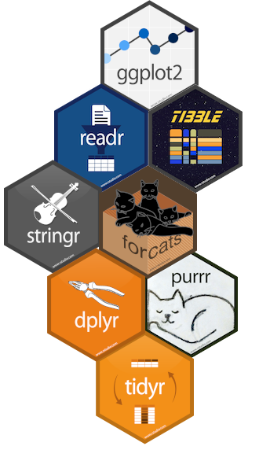
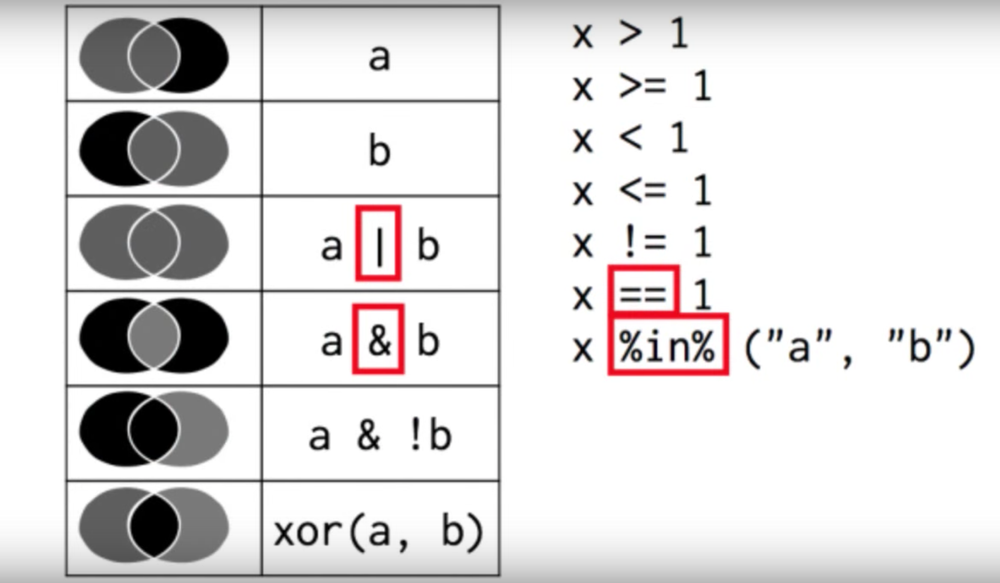

```{r setup, include=FALSE}
options(htmltools.dir.version = FALSE)
```

# The tidyverse

The **tidyverse** is a collection of R packages designed for data science, as a suite aimed
at easening the data analysis in all its steps.

Created by Hadley Wickham, chief scientist of RStudio, and author of more than
30 R packages (`readr`, `ggplot2`, `plyr`, `devtools`, `roxygen2`, `rmarkdown`...)

All packages share an underlying design philosophy, grammar, and data structures. 

```{r tidyverse_schema_fig, echo=FALSE, out.width=450}
knitr::include_graphics('resources/images/tidyverse_schema_2.png', dpi = 90)
```

---

# So what's exactly *in* the tidyverse?

.pull-extleft[]

.pull-extleft_right[

* `ggplot2` a system for creating graphics, based on the Grammar of Graphics

* `readr` a fast and friendly way to read rectangular data (csv, txt...)

* `tibble` a tibble is a re-imagining version of the data frame, keeping what time has proven to be effective and throwing out what has not

* `stringr` provides a cohesive set of functions designed to make working with strings as easy as possible

* `forcats` provides a suite of useful tools that solve common problems with factors

* `dplyr` provides a grammar of data manipulation, providing a consistent set of verbs that solve the most common data manipulation challenges
 
* `tidyr` provides a set of functions that help you get to tidy data
 
* `purrr` enhances R’s functional programming (FP) toolkit by providing a complete and consistent set of tools for working with functions and vectors
]

---
layout: false
class: inverse
background-image: url(resources/images/dplyr.png)

# dplyr

---
layout: true

<div class="tweaked-header" style="background-image: url(resources/images/dplyr.png)"></div>
---

# 5 main verbs of dplyr

  - `filter`: keep the rows that match a condition
  
  - `select`: keep columns by name
  
  - `arrange`: sort rows
  
  - `mutate`: transform existent variables or create new ones
  
  - `summarise`: do some summary statistics and reduce data

---

# common structure

## (for most of the tidyverse)

```r
verb(data, ...)
```

- first argument: data (as data.frame or tbl_df)
- the rest of arguments specify what to do with the data frame
- output is always another data frame (tbl_df or data.frame)
- unless we are assigning (`<-`), never modifies the original data frame

---

.middle[.center[.font200[
`filter`
]]]


.center[]

---

# Data

Let's work with some data. `dplyr` comes with some example data to get the
feeling:

```{r data_babynames}
# install.packages(dplyr)
# install.packages(babynames)
library(dplyr)
library(babynames)
babynames
```


---

# Selecting rows (`filter`)

```{r, filter_ex}
filter(babynames, name == 'Alice')
```


---

# Selecting rows (`filter`)

```{r, filter_ex2}
filter(babynames, year > 2016)
```

---

# Selecting rows (`filter`)

```{r, filter_ex3}
filter(babynames, name %in% c('Ada', 'Leon'))
```

---

# Selecting rows (`filter`)

```{r, filter_ex4}
filter(
  babynames,
  sex == 'F',
  prop > 0.07
)
```

---

# Selecting rows (`filter`)



---

.middle[.center[.font200[
`select`
]]]
.center[]


---

# Selecting columns (`select`)

```{r select_ex}
select(babynames, year)
```

---

# Selecting columns (`select`)

```{r select_ex2}
select(babynames, -prop)
```

---

# Selecting columns (`select`)

```{r select_ex3}
select(babynames, sex, name)
```

---

# Selecting columns (`select`)

```{r select_ex4}
select(babynames, sex:n)
```

---

# Selecting columns (`select`)

## Special functions:

- `starts_with(x)`: names that start with x
- `ends_with(x)`: names that end with x
- `contains(x)`: selects all variables whose name contains x
- `matches(x)`: selects all variables whose name contains the regular expression x
- `num_range("x", 1:5, width = 2)`: selects all variables (numerically) from x01 to x05
- `one_of ("x", "y", "z")`: selects variables provided in a character vector
- `everything()`: selects all variables

---

# Selecting columns (`select`)

```{r select_ex5}
select(babynames, starts_with('n'))
```

---

.middle[.center[.font200[
`arrange`
]]]
.center[]

---

# Sorting rows (`arrange`)

```{r arrange_ex}
arrange(babynames, prop)
```


---

# Sorting rows (`arrange`)

```{r arrange_ex2}
arrange(babynames, desc(prop))
```

---

.middle[.center[.font200[
`mutate`
]]]
.center[]

---

# Transforming variables (`mutate`)

```{r mutate_ex}
mutate(
  babynames,
  total = n / prop
)
```


---

# Transforming variables (`mutate`)

```{r mutate_ex2}
mutate(
  babynames,
  year_diff = 2018 - year,
  months_diff = year_diff * 12
)
```

---

.middle[.center[.font200[
`summarise`
]]]
.center[]

---

# Reducing variables (`summarise`)

```{r summarise_ex}
summarise(babynames, max_prop = max(prop))
```

---

# Reducing variables (`summarise`)

## Summary functions

  - `min(x)`, `max(x)`, `quantile(x, p)`
  
  - `mean(x)`, `median(x)`, 
  
  - `sd(x)`, `var(x)`, `IQR(x)`
  
  - `n()`, `n_distinct(x)`
  
  - `sum(x > 10)`, `mean(x > 10)`
---

.middle[.center[.font200[
`grouped summarise`
]]]


.center[]

---

# Reducing variables (`summarise`)

## Grouped summarise

```{r grouped_summ_ex}
by_year <- group_by(babynames, year)
by_year
```

---

# Reducing variables (`summarise`)

## Grouped summarise

```{r grouped_summ_ex_2}
summarise(
  by_year,
  max_n = max(n)
)
```

---

# Reducing variables (`summarise`)

## Grouped summarise

```{r grouped_summ_ex_3}
by_year_sex <- group_by(babynames, year, sex)

summarise(
  by_year_sex,
  max_n = max(n)
)
```

---
layout: false
class: inverse
background-image: url(resources/images/pipe.png)

# pipes

---
layout: true

<div class="tweaked-header" style="background-image: url(resources/images/pipe.png)"></div>

---

class: code80

# Data pipelines (`%>%`)

  - Often, we want to use several verbs (filter, arrange, group_by, summarise...)

  - Multiple operations are difficult to read, or require to create multiple intermediate
    objects:

.pull-left[

```{r bad_left, eval = FALSE}
year_1880 <- summarise(
  group_by(
    filter(
      babynames, year == 1880
    ),
    sex
  ),
  max = max(n),
  prop = max(prop)
)
```

]

.pull-right[

```{r bad_right, eval = FALSE}
year_1880 <- filter(
  babynames, year == 1880
)
year_1880_grouped <- group_by(
  year_1880, sex
)
summarised_year_1880 <- summarise(
  year_1880_grouped,
  max = max(n),
  prop = max(prop)
)
```

]

---

# Data pipelines (`%>%`)

  - Alternative (cleaner and easy to read): *pipe* operator (`%>%`) from `magrittr` package
  
  - The result of the left side is passed to the function in the right as first argument:
  
  `f(x, y)` is the same as `x %>% f(y)`  
  `f(x, y, z)` is the same as `x %>% f(y, z)`

  - In the tidyverse `%>%` makes each function to be applied to the data frame resulting
    from the previous step
  
  `filter(df, color == 'blue')` is the same as `df %>% filter(color == 'blue')`  
  `mutate(df, double = 2*value)` is the same as `df %>% mutate(double = 2*value)`

---
class: code80

# Data pipelines (`%>%`)

.pull-left[

Nested functions

```{r bad_left_2, eval = FALSE}
year_1880 <- summarise(
  group_by(
    filter(
      babynames, year == 1880
    ),
    sex
  ),
  max = max(n),
  prop = max(prop)
)
```

]

--

.pull-right[

Pipeline

```{r ok_right, eval = FALSE}
year_1880 <- babynames %>%
  filter(year == 1880) %>%
  group_by(sex) %>%
  summarise(
    max = max(n),
    prop = max(prop)
  )
```

]

---

# Applying all together

How do you do to get the names with the maximum proportion for
each year and sex?
We also want the total n for each year and sex.

--

```{r ex_final, eval=FALSE}
babynames %>%
  group_by(year, sex) %>%
  arrange(desc(prop)) %>%
  summarise(
    prop_max = max(prop),
    prop_total = sum(prop),
    name = first(name),
    n_total = sum(n),
    n_year = first(n)
  ) %>%
  select(
    name, sex, year, n_year, n_total, prop_max, prop_total
  ) %>%
  mutate(
    calc_prop = n_year/n_total
  )
```


---
layout: false
class: thanks clear middle

.font160[Thank you!]

<br>

`r icon::fa("twitter")` @MalditoBarbudo  
`r icon::fa("github")` https://github.com/MalditoBarbudo/  
`r icon::fa("envelope")` v.granda@creaf.uab.cat  

<br>

Presentation repository:  
`r icon::fa("github")` https://github.com/MalditoBarbudo/2019_dplyr_girona_aeet

<br>

Acknowledgements:

Aitor Ameztegui .blue[@multivac42]  
.font70[University of Lleida]

